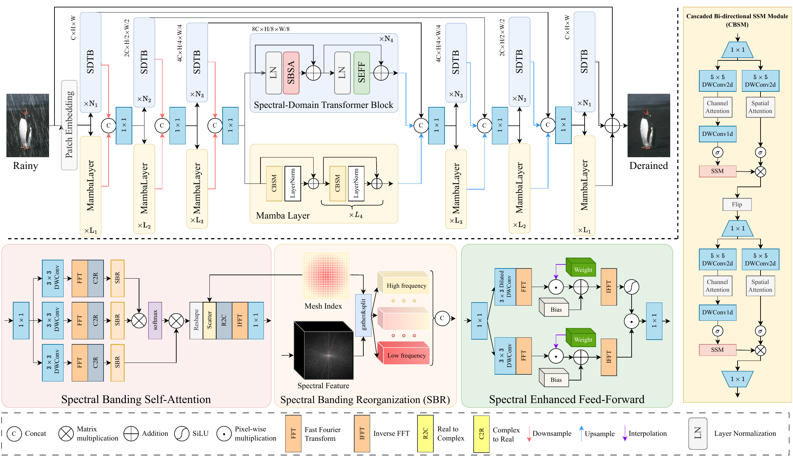

 # <p align=center> A Hybrid Transformer-Mamba Network for Single Image Deraining</p>

<div align="center">
 
[]()
[]()
[]()
[]()
[]()     
[](https://github.com/sunshangquan/TransMamba/issues?q=is%3Aissue+is%3Aclosed) 
[](https://github.com/sunshangquan/TransMamba/issues) 
[](https://hits.seeyoufarm.com)


|   |
|:-------------------------:|
| Network structure |

</div>

---
>**A Hybrid Transformer-Mamba Network for Single Image Deraining**<br>  Shangquan Sun, Wenqi Ren, Juxiang Zhou, Jianhou Gan, Rui Wang, Xiaochun Cao<br> 


<details>
<summary><strong>Abstract</strong> (click to expand) </summary>
Existing deraining Transformers employ self-attention mechanisms with fixed-range windows or along channel dimensions, limiting the exploitation of non-local receptive fields. In response to this issue, we introduce a novel dual-branch hybrid Transformer-Mamba network, denoted as TransMamba, aimed at effectively capturing long-range rain-related dependencies. Based on the prior of distinct spectral-domain features of rain degradation and background, we design a spectral-banded Transformer blocks on the first branch. Self-attention is executed within the combination of the spectral-domain channel dimension to improve the ability of modeling long-range dependencies. To enhance frequency-specific information, we present a spectral enhanced feed-forward module that aggregates features in the spectral domain. In the second branch, Mamba layers are equipped with cascaded bidirectional state space model modules to additionally capture the modeling of both local and global information. At each stage of both the encoder and decoder, we perform channel-wise concatenation of dual-branch features and achieve feature fusion through channel reduction, enabling more effective integration of the multi-scale information from the Transformer and Mamba branches. To better reconstruct innate signal-level relations within clean images, we also develop a spectral coherence loss. Extensive experiments on diverse datasets and real-world images demonstrate the superiority of our method compared against the state-of-the-art approaches.
</details>

## :mega: Citation
If you use TransMamba, please consider citing:

    @article{sun2024hybrid,
      title={A Hybrid Transformer-Mamba Network for Single Image Deraining},
      author={Sun, Shangquan and Ren, Wenqi and Zhou, Juxiang and Gan, Jianhou and Wang, Rui and Cao, Xiaochun},
      journal={arXiv preprint arXiv:2409.00410},
      year={2024}
    }
---

## :rocket: News
* **2024.08.31**: TransMamba is released on Github.


## 🧩 Dataset Preparation
The download links are from [NeRD](https://github.com/cschenxiang/NeRD-Rain)

| Datasets | Download Link | 
|:-----: |:-----: |
| Rain200L | [Baidu Netdisk](https://pan.baidu.com/s/1rTb4qU3fCEA4MRpQss__DA?pwd=s2yx) (s2yx) |
| Rain200H | [Baidu Netdisk](https://pan.baidu.com/s/1KK8R2bPKgcOX8gMXSuKtCQ?pwd=z9br) (z9br) |
| DID-Data | [Baidu Netdisk](https://pan.baidu.com/s/1aPFJExxxTBOzJjngMAOQDA?pwd=5luo) (5luo) |
| DDN-Data | [Baidu Netdisk](https://pan.baidu.com/s/1g_m7RfSUJUtknlWugO1nrw?pwd=ldzo) (ldzo) |
| SPA-Data | [Baidu Netdisk](https://pan.baidu.com/s/1YfxC5OvgYcQCffEttFz8Kg?pwd=yjow) (yjow) |

## :gear: Installation

See [INSTALL.md](INSTALL.md) for the installation of dependencies required to run TransMamba.

## :hammer_and_wrench: Training

1. Download Datasets.

2. Modify the configurations of ```dataroot_gt``` and ```dataroot_lq``` for ```train```, and ```val``` in [Deraining/Options/Deraining_TransMamba_[DATASET].yml](Deraining/Options/)

3. To train TransMamba with default settings, run
```
cd TransMamba
./train.sh Deraining/Options/Deraining_TransMamba.yml 4321
```

**Note:** The above training script uses 4 GPUs by default. 
To use any other settings, for example 8 GPUs, modify ```CUDA_VISIBLE_DEVICES=0,1,2,3,4,5,6,7``` and ```--nproc_per_node=8``` in [TransMamba/train.sh](../train.sh) and ```num_gpu: 8``` [Deraining/Options/Deraining_TransMamba_[DATASET].yml](Deraining/Options/).


## :balance_scale: Evaluation

0. ```cd Deraining```

1. Download the pre-trained [models](https://drive.google.com/drive/folders/15tEklhUdo_chgr13q6oPMqc6dRc0yCku?usp=sharing) and place it in `./pretrained_models/`

2. Download test datasets from each of them, i.e., [Rain200H](https://sites.google.com/view/yunfuliu/desnownet), [DDN-Data](https://github.com/liruoteng/HeavyRainRemoval), and [RainDrop](https://github.com/rui1996/DeRaindrop).

3. Test with the replaced argument ```--input_dir [INPUT_FOLDER]``` and ```[DATASET]```

```
python test.py --input_dir [INPUT_FOLDER] --result_dir result/ --weights pretrained_models/TransMamba_[DATASET].pth --yaml_file Options/Deraining_TransMamba_[DATASET].yml
```

4. Compute PSNR and SSIM by
```
python compute_psnr.py --path1 [GT-PATH] --path2 [Restored-PATH]
```


## :balance_scale: Demo

0. ```cd Deraining```

1. Download the pre-trained [models](https://drive.google.com/drive/folders/15tEklhUdo_chgr13q6oPMqc6dRc0yCku?usp=sharing) and place it in `./pretrained_models/`

2. Test with the replaced argument ```--input_dir [INPUT_FOLDER]```
```
python test.py --input_dir [INPUT_FOLDER] --result_dir result/ --weights pretrained_models/TransMamba_[DATASET].pth --yaml_file Options/Deraining_TransMamba_[DATASET].yml
```


## :mailbox_with_mail: Contact 
If you have any question, please contact shangquansun@gmail.com

**Acknowledgment:** This code is based on the [Mamba](https://github.com/state-spaces/mamba), [NeRD](https://github.com/cschenxiang/NeRD-Rain), [Histoformer](https://github.com/sunshangquan/Histoformer), [Restormer](https://github.com/swz30/Restormer), [BasicSR](https://github.com/xinntao/BasicSR) toolbox and [HINet](https://github.com/megvii-model/HINet). Thanks for their works.
